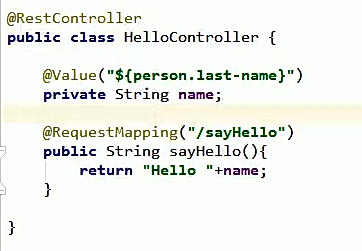
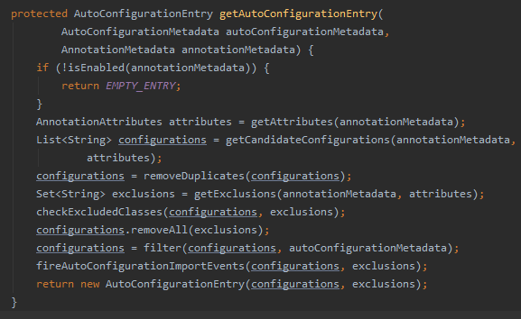

# SpringBoot

### 一、Spring Boot入门  

##### 1.SpringBoot简介

简化Spring应用开发的一个框架

整个Spring技术栈的一个大整合

J2EE开发的一站式解决方案

##### 2.微服务

微服务：架构风格

一个应用应该是一组小型服务：可以通过HTTP方式进行互通

在ssm中把整个项目部署到tomcat上，然后有一点修改，则影响整个项目

每一个功能元素最终都是可替换的，一个可独立升级的单元

详细参照微服务文档

java version "1.8.0_112"

Apache Maven 3.6.2 (40f52333136460af0dc0d7232c0dc0bcf0d9e117; 2019-08-27T23:06:16+08:00)
Maven home: E:\apache-maven-3.6.2\bin\..

##### 3.第一个SpringBoot程序

1.设置maven

```xml
<profile>
	<id>jdk-1.8</id>
	<activation>
		<activeByDefault>true</activeByDefault>
		<jdk>1.8</jdk>
	</activation>
	<properties>
		<maven.compiler.source>1.8</maven.compiler.source>
		<maven.compiler.target>1.8</maven.compiler.target>
	</properties>
</profile>
```

2.导入Springboot的依赖

```java
    <parent>
        <groupId>org.springframework.boot</groupId>
        <artifactId>spring-boot-starter-parent</artifactId>
        <version>1.5.9.RELEASE</version>
    </parent>
<dependencies>
    <dependency>
        <groupId>org.springframework.boot</groupId>
        <artifactId>spring-boot-starter-web</artifactId>
    </dependency>
</dependencies>
```


3.编写一个主程序：启动Springboot应用

```java
import org.springframework.boot.SpringApplication;
import org.springframework.boot.autoconfigure.SpringBootApplication;

//@SpringBootApplication 标识主程序是一个SpringBoot应用
@SpringBootApplication
public class HelloWorld {
    public static void main(String[] args){
        //SpringBoot应用启动起来
        SpringApplication.run(HelloWorld.class,args);
    }
}
```

4.编写相关的Controller，Service

```java
@Controller
public class HelloController {
    @ResponseBody //把返回的东西写回给浏览器
    @RequestMapping("/hello")
    public String hello(){
        return "Hello World!";
    }
}
```

5.直接运行主程序的main方法即可

6.简化部署

将该应用打成jar包，直接在cmd中用

1）如何打jar包

右边框中找到主程序的文件—>Lifecycle->package 双击

打好的包在maven-status中

2）如何部署

C:\Users\ASUS>cd C:\Users\ASUS\Desktop（进入打的jar包所在位置）

C:\Users\ASUS\Desktop>java -jar Springboot_01helloworld-1.0-SNAPSHOT.jar

（使用 java -jar+jar包全名命令）即可在浏览器访问

##### 4.探究Hello World

1.父项目

```xml
<parent>
    <groupId>org.springframework.boot</groupId>
    <artifactId>spring-boot-starter-parent</artifactId>
    <version>1.5.9.RELEASE</version>
</parent>
    
ctrl点artifactId标签即可进去发现它的父项目
  <parent>
		<groupId>org.springframework.boot</groupId>
		<artifactId>spring-boot-dependencies</artifactId>
		<version>1.5.9.RELEASE</version>
		<relativePath>../../spring-boot-dependencies</relativePath>
	</parent>
点它的artifactId可发现它正在管理SpringBoot应用里面的所有版本的依赖
```
Spring Boot版本仲裁中心

以后我们导入依赖默认是不需要写版本的（除非这里面<artifactId>spring-boot-dependencies</artifactId>没有的jar包）

2.导入的依赖

```
<dependency>
    <groupId>org.springframework.boot</groupId>
    <artifactId>spring-boot-starter-web</artifactId>
</dependency>
```

###### spring-boot-starter-web

​	spring-boot-starter: 是spring-boot场景启动器；帮我们导入了web模块正常运行所依赖的组件

spring Boot将所有的功能场景都抽取出来，做成一个个的starter(启动器)，只需要在项目里面引入这些starter相关场景的所有依赖都会导入进来，要用什么就导入什么场景的启动器

###### SpringBoot的注解：

@SpringBootApplication:SpringBoot应用标注在某个类上说明该类是SpringBoot的主配置类，SpringBoot就应该运行这个类的main方法来启动SpringBoot应用

```java
@Target(ElementType.TYPE)
@Retention(RetentionPolicy.RUNTIME)
@Documented
@Inherited
@SpringBootConfiguration
@EnableAutoConfiguration
@ComponentScan(excludeFilters = {
      @Filter(type = FilterType.CUSTOM, classes = TypeExcludeFilter.class),
      @Filter(type = FilterType.CUSTOM, classes = AutoConfigurationExcludeFilter.class) })
```

@SpringBootConfiguration:SpringBoot配置类,标志在某个类，标识这是一个Spring Boot的配置类；

​			@Configuration：配置类上标注这个注解，表示是Spring配置类；

​			配置类即配置文件，配置类也是容器中的一个组件@Component

@EnableAutoConfiguration：开启自动配置功能

​		以前需要配置的东西，SpringBoot帮我们自动配置，该注解告诉SpringBoot开启自动配置功能，这样配置才能生效

```java
@AutoConfigurationPackage
@Import(EnableAutoConfigurationImportSelector.class)
public @interface EnableAutoConfiguration {
```

@AutoConfigurationPackage:自动配置包

​	@Import(AutoConfigurationPackages.Registrar.class)用该注解完成自动配置包 的功能，属于Spring底层注解@Import,给容器中导入一个组件，导入组件由AutoConfigurationPackages.Registrar.class


##### 5.使用Spring Inirializer 快速创建Spring Boot项目

- 主程序已生成，只需要写自己逻辑

- ##### 所有逻辑要和主程序在一个包下面

- resources文件夹目录结构

  - static:保存所有静态资源：js、css、images;
  - templates:保存所有的模板页面（Spring Boot默认jar包使用嵌入式的Tomcat,默认不支持JSP页面）
  - application.properties：SpringBoot应用的配置文件(默认配置好了，这里面可以改)
  
- SpringBoot测试类

  - @RunWith(SpringRunner.class)
  - @SpringBootTest

#### 二、Spring Boot配置

##### 1.配置文件（可以手动修改一些自动默认的SpringBoot配置）

SpringBoot使用一个全局的配置文件，配置文件名固定

- application.properties

- application.yml

  yml以数据为中心，比xml更适合做配置文件

##### 2.YAML语法

1.基本语法

k:(空格)v:表示一堆键值对(空格必须有)

```yaml
server:
  port: 8080
  path: /hello
```

2.值的写法

字面量：普通的值（数字、字符串、boolean)

k:v : 字面量直接写

​		字符串默认不用加单引号或双引号

​	“ zhangsan \n lisi” 输出： zhangsan 换行 lisi

​	'zhangsan \n lisi'  输出：  zhangsan \n lisi

对象、Map

k:v : 再下一行写对象的属性和值

```YAML
friends:
  lastName: zhangsan
  age : 20
```

```yaml
friends: {lastname: zhangsan,age: 20}
```

数组（List、Set)

用-(空格)value表示数组里面的一个元素

```yaml
pet:
  - cat
  - pig
  - dog
```

```yaml
pet: [cat,pig,dog]
```

行内写法

##### 3.获取配置文件信息的注解

###### a.@ConfigurationProperties和@Value

@ConfigurationProperties（类级别，读取全局配置文件）

@ConfigurationProperties：将配置文件中的每一个属性的值，映射到这个组件中

@ConfigurationProperties(prefix="person") :告诉SpringBoot将本类中的所有属性和配置文件中相关的配置进行绑定。

prefix="person"，配置文件中哪个下面的所有属性进行一一映射

@Value（属性级别的注解）当只需要拿配置文件的某一个属性的值的时候可以使用该注解



只有组件是容器中的才能使用容器提供的@ConfigurationProperties(prefix="person") 注解，因此使用该注解前@component

###### b.数据校验：

@validated类上和（@Email加在某个属性上）检测该属性是否是Email格式

###### c.加载配置文件的注解

@PropertySource(value={"classpath:person.properties"})(加载指定的局部配置文件)

@ImportResource(location={})[在主配置类上加这个注解，是将.xml文件作为组件注入到Spring容器中]

不过SpringBoot推荐使用不要写配置文件，应该使用全注解的方式。

写一个配置类@Configuration，在类的方法中@Bean，该方法的返回值被注入Spring的ioc容器中，对应<bean></bean>标签，id是方法名

###### 4.配置文件的占位符

1.随机数

${random.value}

2.占位符获取之前配置的值，如果没有可以用:来指定默认值

person.lastname=张三

person.dog.name=${person.lastname:host}_dog

###### 5.Profile

多种环境下

###### 6.配置文件的加载位置

SpringBoot启动会扫描以下位置的application.properties或者application.yml文件作为Spring boot的默认配置文件

-file:/config/

-file:../

-classpath(resources）:/config/

-classpath(resources）:/

以上是按照优先级从高到低的顺序，所有位置的文件都会被加载，高优先级配置的内容会覆盖低优先级配置的内容

-我们也可以通过配置spring.config.location来改变默认配置

7.自动配置原理：


```java
public String[] selectImports(AnnotationMetadata annotationMetadata) {
   if (!isEnabled(annotationMetadata)) {
      return NO_IMPORTS;
   }
   AutoConfigurationMetadata autoConfigurationMetadata = AutoConfigurationMetadataLoader
         .loadMetadata(this.beanClassLoader);
   AutoConfigurationEntry autoConfigurationEntry = getAutoConfigurationEntry(autoConfigurationMetadata,
         annotationMetadata);
   return StringUtils.toStringArray(autoConfigurationEntry.getConfigurations());
}
```


Spring Boot与日志

#### 四、Spring Boot与web开发

使用SpringBoot:

1)创建SpringBoot应用，选中我们需要的模块

2)SpringBoot已经默认将这些场景配置好了，只需要配置文件中指定的少量配置就可以运行起来

3)自己编写逻辑代码


#### 1.自动配置原理

在启动器main方法的类上的注解@SpringBootApplication

```java
@SpringBootApplication=
@SpringBootConfiguration
@EnableAutoConfiguration
@ComponentScan
```

##### A) @EnableAutoConfiguration

###### 1）Springboot启动时加载主配置类，开启自动配置功能@EnableAutoConfiguration

###### 2）@EnableAutoConfiguration作用：

- 利用AutoConfigurationImportSelector给容器导入组件，导入了哪些组件？


- 进入AutoConfigurationImportSelector类找到方法，找到configurations

  

  获取候选配置

  

  这个方法怎么实现获取候选配置的？

  

  可见其利用SpringFactoriesLoader类

  ```java
  List<String> configurations = SpringFactoriesLoader.loadFactoryNames(
        getSpringFactoriesLoaderFactoryClass(), getBeanClassLoader());
        
  ```

  

  

根据loadSpringFactories(@Nullable ClassLoader classLoader)方法可以知道：先得到所有资源urls（FACTORIES_RESOURCE_LOCATION = "META-INF/spring.factories"）【即扫描所有jar包类路径下的"META-INF/spring.factories"文件】，然后遍历每一个url,将url整合成一个properties，再将properties所有以键值对的形式add如result。然后最终在properties文件中key=EnableAutoConfiguration.class的value值。然后把找到的值的集合添加在容器中后作为configurations。

```java
loadSpringFactories(classLoader).getOrDefault(factoryClassName, Collections.emptyList());
//该方法是在result这个map集合中寻找factoryClassName的值
/*由之前的这个调用SpringFactoriesLoader.loadFactoryNames(
      getSpringFactoriesLoaderFactoryClass(), getBeanClassLoader());
      */
protected Class<?> getSpringFactoriesLoaderFactoryClass() {
		return EnableAutoConfiguration.class;
	}
/*
可以得知要找的key是EnableAutoConfiguration.class
即在properties文件中key=EnableAutoConfiguration.class的value值
*/
```


找到这个：

```properties
# Auto Configure
org.springframework.boot.autoconfigure.EnableAutoConfiguration=\
org.springframework.boot.autoconfigure.admin.SpringApplicationAdminJmxAutoConfiguration,\
org.springframework.boot.autoconfigure.aop.AopAutoConfiguration,\
org.springframework.boot.autoconfigure.amqp.RabbitAutoConfiguration,\
org.springframework.boot.autoconfigure.batch.BatchAutoConfiguration,\
org.springframework.boot.autoconfigure.cache.CacheAutoConfiguration,\
org.springframework.boot.autoconfigure.cassandra.CassandraAutoConfiguration,\
org.springframework.boot.autoconfigure.cloud.CloudServiceConnectorsAutoConfiguration,\
org.springframework.boot.autoconfigure.context.ConfigurationPropertiesAutoConfiguration,\
org.springframework.boot.autoconfigure.context.MessageSourceAutoConfiguration,\
org.springframework.boot.autoconfigure.context.PropertyPlaceholderAutoConfiguration,\
org.springframework.boot.autoconfigure.couchbase.CouchbaseAutoConfiguration,\
org.springframework.boot.autoconfigure.dao.PersistenceExceptionTranslationAutoConfiguration,\
org.springframework.boot.autoconfigure.data.cassandra.CassandraDataAutoConfiguration,\
org.springframework.boot.autoconfigure.data.cassandra.CassandraReactiveDataAutoConfiguration,\
org.springframework.boot.autoconfigure.data.cassandra.CassandraReactiveRepositoriesAutoConfiguration,\
org.springframework.boot.autoconfigure.data.cassandra.CassandraRepositoriesAutoConfiguration,\
org.springframework.boot.autoconfigure.data.couchbase.CouchbaseDataAutoConfiguration,\
org.springframework.boot.autoconfigure.data.couchbase.CouchbaseReactiveDataAutoConfiguration,\
org.springframework.boot.autoconfigure.data.couchbase.CouchbaseReactiveRepositoriesAutoConfiguration,\
org.springframework.boot.autoconfigure.data.couchbase.CouchbaseRepositoriesAutoConfiguration,\
org.springframework.boot.autoconfigure.data.elasticsearch.ElasticsearchAutoConfiguration,\
org.springframework.boot.autoconfigure.data.elasticsearch.ElasticsearchDataAutoConfiguration,\
org.springframework.boot.autoconfigure.data.elasticsearch.ElasticsearchRepositoriesAutoConfiguration,\
org.springframework.boot.autoconfigure.data.jdbc.JdbcRepositoriesAutoConfiguration,\
org.springframework.boot.autoconfigure.data.jpa.JpaRepositoriesAutoConfiguration,\
org.springframework.boot.autoconfigure.data.ldap.LdapRepositoriesAutoConfiguration,\
org.springframework.boot.autoconfigure.data.mongo.MongoDataAutoConfiguration,\
org.springframework.boot.autoconfigure.data.mongo.MongoReactiveDataAutoConfiguration,\
org.springframework.boot.autoconfigure.data.mongo.MongoReactiveRepositoriesAutoConfiguration,\
org.springframework.boot.autoconfigure.data.mongo.MongoRepositoriesAutoConfiguration,\
org.springframework.boot.autoconfigure.data.neo4j.Neo4jDataAutoConfiguration,\
org.springframework.boot.autoconfigure.data.neo4j.Neo4jRepositoriesAutoConfiguration,\
org.springframework.boot.autoconfigure.data.solr.SolrRepositoriesAutoConfiguration,\
org.springframework.boot.autoconfigure.data.redis.RedisAutoConfiguration,\
org.springframework.boot.autoconfigure.data.redis.RedisReactiveAutoConfiguration,\
org.springframework.boot.autoconfigure.data.redis.RedisRepositoriesAutoConfiguration,\
org.springframework.boot.autoconfigure.data.rest.RepositoryRestMvcAutoConfiguration,\
org.springframework.boot.autoconfigure.data.web.SpringDataWebAutoConfiguration,\
org.springframework.boot.autoconfigure.elasticsearch.jest.JestAutoConfiguration,\
org.springframework.boot.autoconfigure.elasticsearch.rest.RestClientAutoConfiguration,\
org.springframework.boot.autoconfigure.flyway.FlywayAutoConfiguration,\
org.springframework.boot.autoconfigure.freemarker.FreeMarkerAutoConfiguration,\
org.springframework.boot.autoconfigure.gson.GsonAutoConfiguration,\
org.springframework.boot.autoconfigure.h2.H2ConsoleAutoConfiguration,\
org.springframework.boot.autoconfigure.hateoas.HypermediaAutoConfiguration,\
org.springframework.boot.autoconfigure.hazelcast.HazelcastAutoConfiguration,\
org.springframework.boot.autoconfigure.hazelcast.HazelcastJpaDependencyAutoConfiguration,\
org.springframework.boot.autoconfigure.http.HttpMessageConvertersAutoConfiguration,\
org.springframework.boot.autoconfigure.http.codec.CodecsAutoConfiguration,\
org.springframework.boot.autoconfigure.influx.InfluxDbAutoConfiguration,\
org.springframework.boot.autoconfigure.info.ProjectInfoAutoConfiguration,\
org.springframework.boot.autoconfigure.integration.IntegrationAutoConfiguration,\
org.springframework.boot.autoconfigure.jackson.JacksonAutoConfiguration,\
org.springframework.boot.autoconfigure.jdbc.DataSourceAutoConfiguration,\
org.springframework.boot.autoconfigure.jdbc.JdbcTemplateAutoConfiguration,\
org.springframework.boot.autoconfigure.jdbc.JndiDataSourceAutoConfiguration,\
org.springframework.boot.autoconfigure.jdbc.XADataSourceAutoConfiguration,\
org.springframework.boot.autoconfigure.jdbc.DataSourceTransactionManagerAutoConfiguration,\
org.springframework.boot.autoconfigure.jms.JmsAutoConfiguration,\
org.springframework.boot.autoconfigure.jmx.JmxAutoConfiguration,\
org.springframework.boot.autoconfigure.jms.JndiConnectionFactoryAutoConfiguration,\
org.springframework.boot.autoconfigure.jms.activemq.ActiveMQAutoConfiguration,\
org.springframework.boot.autoconfigure.jms.artemis.ArtemisAutoConfiguration,\
org.springframework.boot.autoconfigure.groovy.template.GroovyTemplateAutoConfiguration,\
org.springframework.boot.autoconfigure.jersey.JerseyAutoConfiguration,\
org.springframework.boot.autoconfigure.jooq.JooqAutoConfiguration,\
org.springframework.boot.autoconfigure.jsonb.JsonbAutoConfiguration,\
org.springframework.boot.autoconfigure.kafka.KafkaAutoConfiguration,\
org.springframework.boot.autoconfigure.ldap.embedded.EmbeddedLdapAutoConfiguration,\
org.springframework.boot.autoconfigure.ldap.LdapAutoConfiguration,\
org.springframework.boot.autoconfigure.liquibase.LiquibaseAutoConfiguration,\
org.springframework.boot.autoconfigure.mail.MailSenderAutoConfiguration,\
org.springframework.boot.autoconfigure.mail.MailSenderValidatorAutoConfiguration,\
org.springframework.boot.autoconfigure.mongo.embedded.EmbeddedMongoAutoConfiguration,\
org.springframework.boot.autoconfigure.mongo.MongoAutoConfiguration,\
org.springframework.boot.autoconfigure.mongo.MongoReactiveAutoConfiguration,\
org.springframework.boot.autoconfigure.mustache.MustacheAutoConfiguration,\
org.springframework.boot.autoconfigure.orm.jpa.HibernateJpaAutoConfiguration,\
org.springframework.boot.autoconfigure.quartz.QuartzAutoConfiguration,\
org.springframework.boot.autoconfigure.reactor.core.ReactorCoreAutoConfiguration,\
org.springframework.boot.autoconfigure.security.servlet.SecurityAutoConfiguration,\
org.springframework.boot.autoconfigure.security.servlet.SecurityRequestMatcherProviderAutoConfiguration,\
org.springframework.boot.autoconfigure.security.servlet.UserDetailsServiceAutoConfiguration,\
org.springframework.boot.autoconfigure.security.servlet.SecurityFilterAutoConfiguration,\
org.springframework.boot.autoconfigure.security.reactive.ReactiveSecurityAutoConfiguration,\
org.springframework.boot.autoconfigure.security.reactive.ReactiveUserDetailsServiceAutoConfiguration,\
org.springframework.boot.autoconfigure.sendgrid.SendGridAutoConfiguration,\
org.springframework.boot.autoconfigure.session.SessionAutoConfiguration,\
org.springframework.boot.autoconfigure.security.oauth2.client.servlet.OAuth2ClientAutoConfiguration,\
org.springframework.boot.autoconfigure.security.oauth2.client.reactive.ReactiveOAuth2ClientAutoConfiguration,\
org.springframework.boot.autoconfigure.security.oauth2.resource.servlet.OAuth2ResourceServerAutoConfiguration,\
org.springframework.boot.autoconfigure.security.oauth2.resource.reactive.ReactiveOAuth2ResourceServerAutoConfiguration,\
org.springframework.boot.autoconfigure.solr.SolrAutoConfiguration,\
org.springframework.boot.autoconfigure.task.TaskExecutionAutoConfiguration,\
org.springframework.boot.autoconfigure.task.TaskSchedulingAutoConfiguration,\
org.springframework.boot.autoconfigure.thymeleaf.ThymeleafAutoConfiguration,\
org.springframework.boot.autoconfigure.transaction.TransactionAutoConfiguration,\
org.springframework.boot.autoconfigure.transaction.jta.JtaAutoConfiguration,\
org.springframework.boot.autoconfigure.validation.ValidationAutoConfiguration,\
org.springframework.boot.autoconfigure.web.client.RestTemplateAutoConfiguration,\
org.springframework.boot.autoconfigure.web.embedded.EmbeddedWebServerFactoryCustomizerAutoConfiguration,\
org.springframework.boot.autoconfigure.web.reactive.HttpHandlerAutoConfiguration,\
org.springframework.boot.autoconfigure.web.reactive.ReactiveWebServerFactoryAutoConfiguration,\
org.springframework.boot.autoconfigure.web.reactive.WebFluxAutoConfiguration,\
org.springframework.boot.autoconfigure.web.reactive.error.ErrorWebFluxAutoConfiguration,\
org.springframework.boot.autoconfigure.web.reactive.function.client.ClientHttpConnectorAutoConfiguration,\
org.springframework.boot.autoconfigure.web.reactive.function.client.WebClientAutoConfiguration,\
org.springframework.boot.autoconfigure.web.servlet.DispatcherServletAutoConfiguration,\
org.springframework.boot.autoconfigure.web.servlet.ServletWebServerFactoryAutoConfiguration,\
org.springframework.boot.autoconfigure.web.servlet.error.ErrorMvcAutoConfiguration,\
org.springframework.boot.autoconfigure.web.servlet.HttpEncodingAutoConfiguration,\
org.springframework.boot.autoconfigure.web.servlet.MultipartAutoConfiguration,\
org.springframework.boot.autoconfigure.web.servlet.WebMvcAutoConfiguration,\
org.springframework.boot.autoconfigure.websocket.reactive.WebSocketReactiveAutoConfiguration,\
org.springframework.boot.autoconfigure.websocket.servlet.WebSocketServletAutoConfiguration,\
org.springframework.boot.autoconfigure.websocket.servlet.WebSocketMessagingAutoConfiguration,\
org.springframework.boot.autoconfigure.webservices.WebServicesAutoConfiguration,\
org.springframework.boot.autoconfigure.webservices.client.WebServiceTemplateAutoConfiguration
```

每一个xxxxxAutoConfiguration类都被加到IOC容器中，这些类的作用是帮我们给容器中自动装配组件，当这些自动配置类加入到容器中之后，我们的Springboot的自动装配机制才起作用

###### 3）每一个自动配置类如何进行自动配置功能

举例：


```java
@Configuration //表示这是一个配置类,就像以前xml的配置文件的<beans><beans>一样，在该类下面有方法级别的@bean表示要添加的到IOC容器的组件 
<beans></beans>
@EnableConfigurationProperties(HttpProperties.class)
 //启用指定类（HttpProperties.class）的ConfigurationProperties功能，配置文件properties中的值和HttpProperties.class中的属性绑定起来了
    
//@Conditionalxxxxx代表条件选择注解
@ConditionalOnWebApplication(type = ConditionalOnWebApplication.Type.SERVLET)
 //这个注解是判断当前应用是否是web应用下，如果是该配置类生效，否则不生效
@ConditionalOnClass(CharacterEncodingFilter.class)
 //判断当前项目中有没有CharacterEncodingFilter.class：springmvc中乱码解决过滤器，如果有该配置类生效，否则不生效
@ConditionalOnProperty(prefix = "spring.http.encoding", value = "enabled", matchIfMissing = true)
//判断properties中是否存在某个配置spring.http.encoding.enabled
//因为matchIfMissing = true，所以无论存在与否，该配置类都是生效的
public class HttpEncodingAutoConfiguration {

    //已经和Springboot的配置文件映射，如何映射？
    /*ConfigurationProperties(prefix = "spring.http")
	public class HttpProperties {
	}
	HttpProperties的属性值都和Springboot的spring.http前缀的配置文件的属性值相映射
    */
   private final HttpProperties.Encoding properties;

	@Bean //给IOC容器中添加组件<bean id="characterEncodingFilter" class="CharacterEncodingFilter"></bean>
    //该组件中的某些属性值需要从properties中获取
	@ConditionalOnMissingBean
	public CharacterEncodingFilter characterEncodingFilter() {
		CharacterEncodingFilter filter = new OrderedCharacterEncodingFilter();
		filter.setEncoding(this.properties.getCharset().name());
		filter.setForceRequestEncoding(this.properties.shouldForce(Type.REQUEST));
		filter.setForceResponseEncoding(this.properties.shouldForce(Type.RESPONSE));
		return filter;
	}
   @Bean
	public LocaleCharsetMappingsCustomizer localeCharsetMappingsCustomizer() {
		return new LocaleCharsetMappingsCustomizer(this.properties);
	}
    /*
    这里类似配置文件中
    <bean id="localeCharsetMappingsCustomizer" class="LocaleCharsetMappingsCustomizer ">
    <p
    </bean>
    */
	
```

所有在配置文件中能配置的属性都是xxxxproperties类中封装着，配置文件能配置什么，就参照某个功能对应的属性类

```java
@ConfigurationProperties(prefix = "spring.http")
//从指定配置文件中获取属性值和bean的属性值进行绑定
public class HttpProperties {
}
```


根据xxxproperties中的类的属性来知道application.yml中要配置哪些属性：

```yml
	spring.http.encoding.force=true;

​	spring.http.encoding.forceRequest=true;
```

一旦配置类生效，这个配置类就会给容器添加各种组件，这些组件的属性值是和配置文件的属性值绑定的


##### 通过样例知道了：SpringBoot的精髓：

1）SpringBoot启动会加载大量的自动配置类

2）我们看我们需要的功能有没有SpringBoot默认写好的自动配置类

3）再来看这个自动配置类中到底配置了哪些组件，只要我们需要的组件容器中有，我们就不需要再配置，如果没有，需要自己写一个配置类将相应的组件添加到容器中去

4）给容器中自动配置类添加组件时会从xxxxproperties类中拿属性，我们可以通过配置文件属性值和xxxxproperties类中属性绑定

xxxxAotuConfiguration:自动配置类

给容器中添加组件

xxxxproperties:封装配置文件中相关的属性（key)

##### 2.SpringBoot静态资源的映射规则

IDEA查询快捷键ctrl+n


```java
@Override
		public void addResourceHandlers(ResourceHandlerRegistry registry) {
			if (!this.resourceProperties.isAddMappings()) {
				logger.debug("Default resource handling disabled");
				return;
			}
			Duration cachePeriod = this.resourceProperties.getCache().getPeriod();
			CacheControl cacheControl = this.resourceProperties.getCache().getCachecontrol().toHttpCacheControl();
			if (!registry.hasMappingForPattern("/webjars/**")) {
				customizeResourceHandlerRegistration(registry.addResourceHandler("/webjars/**")
						.addResourceLocations("classpath:/META-INF/resources/webjars/")
						.setCachePeriod(getSeconds(cachePeriod)).setCacheControl(cacheControl));
			}
			String staticPathPattern = this.mvcProperties.getStaticPathPattern();
			if (!registry.hasMappingForPattern(staticPathPattern)) {
				customizeResourceHandlerRegistration(registry.addResourceHandler(staticPathPattern)
						.addResourceLocations(getResourceLocations(this.resourceProperties.getStaticLocations()))
						.setCachePeriod(getSeconds(cachePeriod)).setCacheControl(cacheControl));
			}
		}
```

1)所有/webjars/**,都去classpath:/META-INF/resource/webjar找资源

webjars:以jar包的方式引入静态资源

ctrl+z调到程序多少行

2）模板引擎

theymeleaf：

只有在pom.xml中导入theymeleaf的依赖

```xml
<dependency>
    <groupId>org.springframework.boot</groupId>
    <artifactId>spring-boot-starter-thymeleaf</artifactId>
</dependency>
```

在templates的静态页面资源在能直接通过

localhost:8080/xxx访问

因为默认的theymeleaf版本较低

所以在添加这些标签

```xml
<properties>
    <java.version>1.8</java.version>
    <thymeleaf.version>3.0.2.RELEASE</thymeleaf.version>
    <thymeleaf-layout-dialect.version>2.1.1</thymeleaf-layout-dialect.version>
</properties>
```

注意：

1.

Spriongboot创建的项目，在resources  -> templates下的资源是不能直接访问的，没有开放访问权限。这是因为templates文件夹，是放置模板文件的，因此需要视图解析器来解析它。所以必须通过服务器内部进行访问，也就是要走控制器  ->  服务  ->  视图解析器这个流程才行。同时，存在安全问题。比如说，你把你后台的html文件放到templates，而这个文件夹对外又是开放的，就会存在安全隐患

> 这里提供两种可以方式访问templates模板下的资源文件
>  方式一：在application.yml或者application.properties配置文件中将访问权限开放（这种方式不推荐）


```jsx
spring:
  resources:
    static-locations: classpath:/META-INF/resources/, classpath:/resources/, classpath:/static/, classpath:/public/, classpath:/templates/
```

或者


```jsx
spring.resources.static-locations=classpath:/META-INF/resources/,classpath:/resources/,classpath:/static/,classpath:/public/,classpath:/templates/
```

> 方式二：通过内部controller跳转访问的资源

比如要访问templates下的test.html。先请求内部控制器，由控制器跳转test.html页面


image.png


```kotlin
@Controller
public class Test {

    @GetMapping("/test")
    public String test() {
        return "test";
    }
}
```


2.要在导入的html文件中添加

```html
<html  xmlns:th="http://www.thymeleaf.org"><!-- 添加thymeleaf语法提示 -->
    
<link rel="stylesheet" href="../static/css/layui.css" th:href="@{/css/layui.css}">
<script src="../static/layui.all.js" th:href="@{/layui.all.js}"></script>
    <!--引入的这两个外部资源 需要 th:href="",让thymeleaf读到这两个引用资源-->
 
    <!--图片也要加，这样才能保证搞好的前端页面不会乱-->
```

3.theymeleaf的语法规则

1)后端数据传到前端

后端数据都可以传到th:**代表前端什么属性

​	th:text=

​	th:each

​	th:if

​	th:attr

​	th:object =前端的对象

​	th:filed=“${后端属性/对象}”  前端数据返回给后端

表达式语法

​	${}:获取变量的值

​	*{}的作用

	<div th:object="${user}">
	    <p>
	        <span th:text="{name}"></span> 获取对象User.name的属性
	    </p>
	</div>
@{}定义URL的链接的


4.首先我们讲解下springboot资源目录下的几种静态目录，

 /META-INF/resources

resources

static

public


 

 这几种有什么作用呢？这几个目录都是springboot默认提供的静态资源访问路径，他们的根路径都是“/”

什么意思呢？就是说在访问这些目录下面文件的时候，他们的访问目录和resources下面文件的访问目录是一样的，就比如我们之前访问的目录都没有加static之类的

那么久大有可为了，我们给不同的目录分配不同的功能，使代码看起来更加清晰明了

既然如此，万一这些目录下面的文件重名了会如何执行呢？他们之间是有有限顺序的，这个顺序默认是/META-INF/resources>resources>static>public，但是后面会说如何更改

那么还有一个问题是，如果我想自己创建一个目录也是可以通过访问根路径的方式访问该目录下的资源，那我该怎么办？接下来就是正题。

首先我们有两种方式进行配置，但他们的本质是一样的，我这里创建了一个test目录

-1 配置application.yml的方式

[?](https://www.cnblogs.com/shuaiqin/p/11517849.html#)

```
spring:`` ``mvc:``  ``static-path-pattern: /**`` ``resources:``  ``static-locations: classpath:/test/,classpath:/static/js/,classpath:/META-INF/resources/,classpath:/resources/,classpath:/static/,classpath:/public/
```

　这里我们配置了两部分，

第一：static-path-pattern，这个配置项是告诉springboot，应该以什么样的方式去寻找资源。默认配置为 /* 。换句话说，只有静态资源满足什么样的匹配条件，Spring Boot才会处理静态资源请求，我们也可配置成 /user/**,这样我们必须输入/user/index.html才能访问到这些目录下的资源，

第二：spring.resources.static-locations，这个配置项是告诉springboot去哪找资源，根据前后关系确定优先级，也就是说如果/META-INF/resources/目录和/resources都有一个index.html，那么根据默认的优先级，会去访问/test/下的资源。（tips：当更改了此项配置，默认的项目也需要加上，不然会被覆盖，详情可见源码）

那么我们来实验一下：我在每个目录下面都写了index.html


当我访问index.html的时候，优先级最高的就是test目录下的资源


#### 五、SpringBoot与数据访问

##### 1.SpringBoot与jdbc

###### a.连接jdbc相关的依赖

web

SQL

​	jdbc

​	Mysql

```xml
<dependency>
    <groupId>org.springframework.boot</groupId>
    <artifactId>spring-boot-starter-jdbc</artifactId>
</dependency>
<dependency>
            <groupId>mysql</groupId>
            <artifactId>mysql-connector-java</artifactId>
            <scope>runtime</scope>
        </dependency>
```


###### b.在application.yml配置数据源datasource信息

```yml
spring:
  datasource:
    username: root
    password:
    url: jdbc:mysql://127.0.0.1:3306/blog?serverTimezone=Asia/Shanghai&amp;characterEncoding=utf8
    driver-class-name: com.mysql.jdbc.Driver
    schema:
     - classpath:sql/t_user.sql
```

要想默认数据源能完成两个功能

​	1）运行建表语句

​	2）运行插入数据语句

需要做到：

​	1）将sql文件改名为：

```
schema-*.sql(创建), data-*.sql（插入)
```

	2)  schema:
	 - classpath:sql/t_user.sql
###### c.ctrl+shift+t 创建测试类

@RunWith(SpringRunner.class)

@SpringBootTest

```xml
<dependency>
    <groupId>junit</groupId>
    <artifactId>junit</artifactId>
    <version>4.12</version>
    <scope>test</scope>
    
</dependency>
<dependency>
            <groupId>org.springframework.boot</groupId>
            <artifactId>spring-boot-starter-test</artifactId>
            <scope>test</scope>
            <exclusions>
                <exclusion>
                    <groupId>org.junit.vintage</groupId>
                    <artifactId>junit-vintage-engine</artifactId>
                </exclusion>
            </exclusions>
        </dependency>
```

以上两个注解需要pom.xml中有以上两个依赖


##### 2.Spring Boot整合Mybatis

###### a.初始选择模块

​	web

​	SQL

​		JDBC

​		Mysql

​		Mybatis

```xml
<dependency>
    <groupId>org.mybatis.spring.boot</groupId>
    <artifactId>mybatis-spring-boot-starter</artifactId>
    <version>2.1.2</version>
</dependency>
```

###### b.配置数据源

​	1)参见jdbc配置datasource:

​	2)创建javabean


1.注解版

1)写mapper类

每个类上加@Mapper/在主程序类上加解决：在主程序类上加注解，扫描Dao层

```java
@MapperScan(value="com.example.demo.dao.UserDao")
```

在每个方法上面加@sql注解

2）

MybatisConfig全局配置类，解决实体类中属性名和表字段名不同的问题

```java
@Configuration
public class MybatisConfig {
    @Bean
    public ConfigurationCustomizer configurationCustomizer(){
        return new ConfigurationCustomizer() {
            @Override
            public void customize(org.apache.ibatis.session.Configuration configuration) {
                configuration.setMapUnderscoreToCamelCase(true);
            }
        };
    }
}
```

2.注解版和xml文件合体

1）配置Mybatis-config.xml全局mybatis配置文件

```xml
<?xml version="1.0" encoding="UTF-8"?> <!DOCTYPE configuration PUBLIC "-//mybatis.org//DTD Config 3.0//EN"
        "http://mybatis.org/dtd/mybatis-3-config.dtd">
<configuration>
    <!--配置全局属性-->
    <settings>
        <!--使用jdbc的getGeneratedKeys获取数据库自增主键值-->
        <setting name="useGeneratedKeys" value="true"/>
        <!--使用列别名替换列名，
            select name as title from table
            name是表中列名，title是实体属性名。这样写能够讲实体属性与表中列相映射
        -->
        <setting name="useColumnLabel" value="true"/>
        <!--开启驼峰命名转换：Table(create_time)->Entity：(createtime)
            自动下划线去掉转换，不用列别名替换列名-->
        <setting name="mapUnderscoreToCamelCase" value="true"/>
    </settings>
</configuration>
```


2）sql映射文件mapper，即（通过xml对DAO层的实现）

```xml
<?xml version="1.0" encoding="UTF-8" ?>
<!DOCTYPE mapper
        PUBLIC "-//mybatis.org//DTD Mapper 3.0//EN"
        "http://mybatis.org/dtd/mybatis-3-mapper.dtd">
<mapper namespace="com.example.demo.dao.UserDao">
   <select id="findById" resultType="user">
        select *from t_user where user_id=#{id};
   </select>
</mapper>
```


3）application.yml中加入

```yml
mybatis:
  config-location: classpath:mybatis/mybatis-config.xml
  //mybatis全局配置的位置
  mapper-locations: classpath:mybatis/mapper/*.xml
  //mapper的位置
```

4）

注解方式：

 报错：

The injection point has the following annotations:

- @org.springframework.beans.factory.annotation.Autowired(required=true)
  Action:
  Consider defining a bean of type 'com.example.operationplatform.dao.MenuDao' in your configuration.

解决方法：在启动类上添加注解MapperScan，把DAO层扫描进来

这里有个大坑，这个注解是扫描包的，不是扫描文件，所以不能dao.*

```java
@MapperScan(value = "com.example.demo.dao")
```

或者直接在mapper接口上加@Mapper,如果两个同时使用@MapperScan会将@Mapper覆盖


配置方式：

报错：org.springframework.beans.factory.UnsatisfiedDependencyException: Error creating bean with name 'userController': Unsatisfied dependency expressed through field 'userIService'; nested exception is org.sp........Cannot find class: User

解决方法：

因为找不到User,是因为查询返回类型没有写全类名...我真的痛苦！！

```xml
<select id="findById" resultType="com.example.demo.bean.User">
     select *from t_user where user_id=#{id};
</select>
```


Spring Boot与Docker。**

**Spring Boot与数据访问**s

**Spring Boot启动配置原理**

**Spring Boot自定义starters**

**Spring Boot与缓存**

**Spring Boot与消息**

Spring Boot与检索

**Spring Boot与任务**

**Spring Boot与安全**

**Spring Boot与分布式**

**Spring Boot与开发热部署**

**Spring Boot与监控管理**

##### Typora快捷键

- 无序列表：输入-之后输入空格
- 有序列表：输入数字+“.”之后输入空格
- 任务列表：-[空格]空格 文字
- 标题：ctrl+数字
- 表格：ctrl+t
- 生成目录：[TOC]按回车
- 选中一整行：ctrl+l
- 选中单词：ctrl+d
- 选中相同格式的文字：ctrl+e
- 跳转到文章开头：ctrl+home
- 跳转到文章结尾：ctrl+end
- 搜索：ctrl+f
- 替换：ctrl+h
- 引用：输入>之后输入空格
- 代码块：ctrl+alt+f
- 加粗：ctrl+b
- 倾斜：ctrl+i
- 下划线：ctrl+u
- 删除线：alt+shift+5
- 插入图片：直接拖动到指定位置即可或者ctrl+shift+i
- 插入链接：ctrl + k

