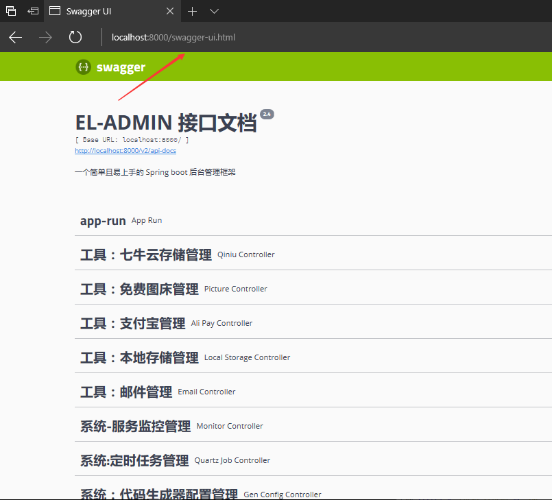

下载开源项目分析过程：

##### 1.分析项目用到哪些技术，需要哪些环境

配置相应的环境。

##### 2.项目要跑起来

###### a.sql跑起来

###### b.前端 目录>npm install

前端启动>npm run dev

###### c.后端在IDEA open

1.查看配置文件与自己配置不匹配的地方，如数据库名和数据库密码，端口号等进行修改

2.运行的时候首先进入swagger-ui页面，都是接口

前端安装依赖，启动测试，看接口是否正常

##### 3.前后端分离项目固定套路

1.从前端分析，打开接口，分析调用关系

2.前后端口不一致 8000 8013 ？怎么做到的

​	封装接口请求，ajax vue用axios request

​    

